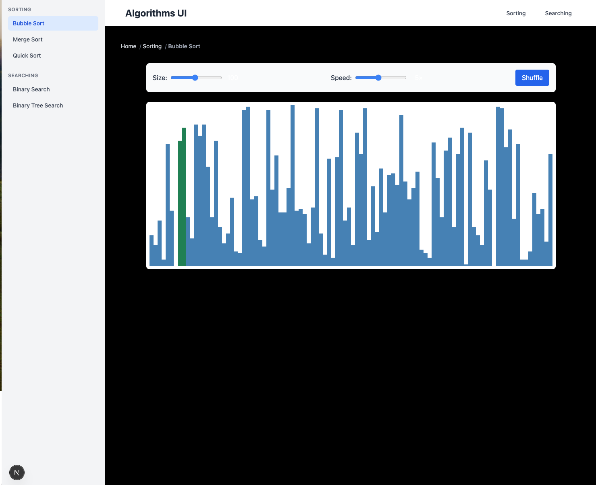

# algorithms‑ui

[](https://github.com/Zyoruk/algorithms-ui/actions)  
[](LICENSE)

**algorithms‑ui** is an educational Next.js application that visualizes common algorithms and data structures. Current features include:

- Searching: Binary Search, Binary Tree Search  
- Sorting: Quick Sort, Merge Sort, etc.  
- (More algorithms coming soon)

## Table of Contents

1. [Demo](#demo)  
2. [Tech Stack](#tech-stack)  
3. [Installation](#installation)  
4. [Usage](#usage)  
5. [Available Scripts](#available-scripts)  
6. [Contributing](#contributing)  
7. [License](#license)  

## Demo



## Tech Stack

- Next.js (App Router)  
- React 18 & TypeScript  
- Tailwind CSS  
- D3.js for SVG animations  

## Installation

```bash
git clone https://github.com/Zyoruk/algorithms-ui.git
cd algorithms-ui
npm install
# or
yarn install
# or
pnpm install
```

## Usage

Start the development server:

```bash
npm run dev
```

Open <http://localhost:3000> in your browser.  
Build and start in production:

```bash
npm run build
npm start
```

## Available Scripts

| Command       | Description                          |
| ------------- | ------------------------------------ |
| npm run dev   | Run the app in development mode      |
| npm run build | Build the app for production         |
| npm start     | Start the production server          |
| npm run lint  | Run ESLint and TypeScript checks     |

## Contributing

Contributions are welcome! Please:

1. Fork the repository  
2. Create a feature branch (`git checkout -b feature/foo`)  
3. Commit your changes (`git commit -m 'feat: add new algorithm'`)  
4. Push to your branch (`git push origin feature/foo`)  
5. Open a Pull Request  

Refer to [CODE_OF_CONDUCT.md](/CODE_OF_CONDUCT.md) and [CONTRIBUTING.md](/CONTRIBUTING.md) for more details.

## License

This project is licensed under the MIT License. See the [LICENSE](LICENSE) file for details.
